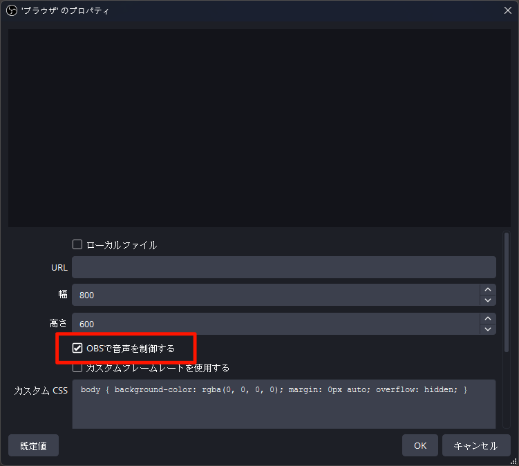
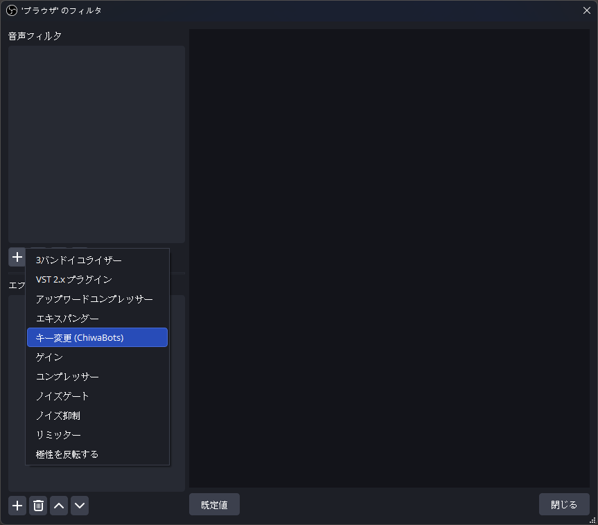
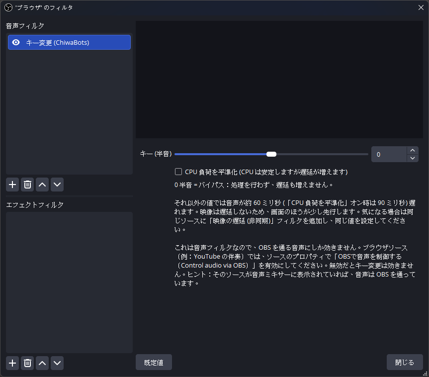
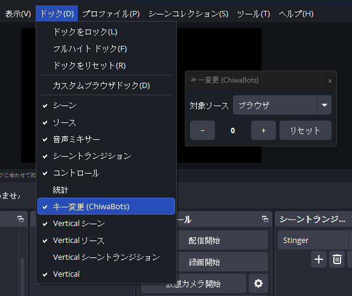

# cb-pitch-shift

[English](README.md) · [繁體中文](README.zh-TW.md) · **日本語**

[OBS Studio](https://obsproject.com/) 用のピッチシフト（キー変更）音声フィルタです。ソースの音声をテンポを変えずに半音単位で上下させます。配信中にワンクリックでキーを変えられるドックも付いています。

主な用途は歌ってみたやカラオケ配信です。伴奏をブラウザソースかメディアソースに置き、このフィルタを追加して、歌い手の音域に合わせてキーを上げ下げします。マイクは別のソースに載せるので、歌声には影響しません。

これは [ChiwaBots](https://chiwabots.com) が作ったサードパーティ製プラグインです。OBS Studio の一部ではなく、OBS Project とも関係はありません。下記の[商標について](#商標について)と [AI の使用について](#ai-の使用について)を参照してください。

**目次：** [機能](#機能) · [インストール](#インストール) · [アンインストール](#アンインストール) · [使い方](#使い方) · [ソースからのビルド](#ソースからのビルド) · [AI の使用について](#ai-の使用について) · [ライセンス](#ライセンス)

## 機能

- -12 から +12 半音まで移調できます。テンポは保持されます（位相ボコーダー方式）。
- 0 半音はバイパスです。処理も遅延の増加もありません。
- 有効時は音声が約 60 ms 一定で遅れます（フィルタ内の説明を参照）。映像は遅れないので、正確に合わせたい場合は同じソースに「映像の遅延（非同期）」フィルタを追加してください。
- ドック（OBS 上の名前は「キー変更 (ChiwaBots)」）で、対象ソースの選択、`-` / `+` でのキー変更、リセット、現在値の確認ができます。対象の音声が OBS を通っていない場合はドックに警告が出ます。
- 6 言語対応：English、繁體中文、简体中文、日本語、한국어、Español。
- Windows、macOS、Linux に対応。OBS 31.1 以降が必要です。

## インストール

*Releases* ページからお使いのプラットフォーム向けのファイルをダウンロードします。

### Windows

2 通りあります。

- **インストーラー**（`…-windows-x64.exe`）：ダブルクリックしてウィザードに従います。コード署名がないため、初回は Windows SmartScreen が「不明な発行元」の警告を出します。*詳細情報*、続けて*実行*をクリックしてください。ウィザードは Windows の表示言語（英、繁中、简中、日、韓、西）に従います。
- **ZIP**（`…-windows-x64.zip`）：`cb-pitch-shift` フォルダを `%ProgramData%\obs-studio\plugins\` にコピーします。SmartScreen の警告は出ませんが、導入も削除も手動です。

その後 OBS を再起動してください。

ポータブル版の OBS は `%ProgramData%` ではなく自身のフォルダを基準にプラグインを探すため、インストーラーは使えません。ZIP を使い、`cb-pitch-shift\bin\64bit\cb-pitch-shift.dll` を `<あなたの OBS>\obs-plugins\64bit\` に、`cb-pitch-shift\data\` の中身を `<あなたの OBS>\data\obs-plugins\cb-pitch-shift\` にコピーしてください。

### macOS

`.pkg` を開いてインストーラーに従い、OBS を再起動します。

この `.pkg` は公証されていません。公証には有料の Apple Developer アカウントが必要なためです。そのため Gatekeeper が初回にブロックします。ダブルクリックすると「Apple はこのファイルにマルウェアが含まれていないことを確認できません」と表示され、「完了」と「ゴミ箱に入れる」しかなく「開く」ボタンがありません。「完了」を押してから、次のどちらかを一度だけ行ってください。

- ターミナルでダウンロード隔離属性を外し、`.pkg` をもう一度開きます。

  ```bash
  xattr -dr com.apple.quarantine ~/Downloads/cb-pitch-shift-*-macos-universal.pkg
  ```

- または*システム設定 → プライバシーとセキュリティ*を開いて下にスクロールし、ブロックされた `.pkg` の横の「このまま開く」をクリックし、認証してから `.pkg` をもう一度開きます。

インストーラーは `cb-pitch-shift.plugin` を `~/Library/Application Support/obs-studio/plugins/` に置きます。Apple Silicon では読み込みに最低でも ad-hoc 署名が必要ですが、CI ビルドで付与済みなので、インストール後はそのまま読み込まれます。

### Linux

2 通りあります。

- **`.deb`**：`sudo apt install ./cb-pitch-shift-*.deb`。`/usr` にインストールされます。公式 OBS PPA（`ppa:obsproject/obs-studio`）やディストリのパッケージの OBS はここにあります。OBS がプラグインを認識しない場合、OBS が別のプレフィックス（`/usr/local` に置いたビルドや Flatpak/Snap のサンドボックスなど）に入っている可能性が高いです。下記を参照してください。
- **ユーザーディレクトリへの配置**：サンドボックスでない OBS ならどれでも動き、`sudo` も不要で、OBS を更新しても消えません。tarball を展開（または `.deb` のファイルをコピー）して `~/.config/obs-studio/plugins/cb-pitch-shift/` に次の構成で置きます。

  ```
  ~/.config/obs-studio/plugins/cb-pitch-shift/bin/64bit/cb-pitch-shift.so
  ~/.config/obs-studio/plugins/cb-pitch-shift/data/locale/*.ini
  ```

その後 OBS を再起動してください。

インストールしたのに OBS にフィルタが出ない場合、ほとんどはパスの不一致です。OBS は自身のインストールプレフィックス配下のプラグインディレクトリをスキャンします。`dpkg -L obs-studio | grep obs-plugins` で OBS 本体のプラグインの場所を確認し、`.so` を同じツリーに置いてください。Flatpak と Snap の OBS はサンドボックスなので、システムに入れたプラグインは見えません。その場合はユーザーディレクトリへの配置を使うか、公式 PPA の OBS をインストールしてください。

## アンインストール

- **Windows（インストーラー）：** *設定 → アプリ*（または*コントロールパネル → プログラムと機能*）で **キー変更 (ChiwaBots)** を探してアンインストールします。
- **Windows（ZIP）：** `%ProgramData%\obs-studio\plugins\` の `cb-pitch-shift` フォルダを削除します。
- **macOS：** `~/Library/Application Support/obs-studio/plugins/cb-pitch-shift.plugin` を削除します。`.pkg` にはアンインストーラーがないため手動です。
- **Linux（.deb）：** `sudo apt remove cb-pitch-shift`（または `sudo dpkg -r cb-pitch-shift`）。
- **Linux（ユーザーディレクトリ）：** `~/.config/obs-studio/plugins/cb-pitch-shift/` を削除します。

その後 OBS を再起動してください。

## 使い方

### 1. 伴奏を専用のソースに置く

伴奏をブラウザソース（YouTube やカラオケのリンク）またはメディアソース（ローカルファイル）として追加します。歌い手のマイクは別のソースに置いてください。フィルタは追加したソースにだけ効くので、歌声はそのままです。

### 2. 伴奏の音声を OBS に通す

これは音声フィルタなので、OBS を通る音声しか処理できません。ブラウザソースは既定で音声をスピーカーへ直接流すため、フィルタには何も届きません。ソースの**プロパティ**を開き、**OBSで音声を制御する**を有効にしてください。有効にすると、そのソースが音声ミキサーに表示されます。それが音声が OBS を通っている目印です。



### 3. フィルタを追加する

伴奏ソースを右クリックして**フィルタ**を選びます。*音声フィルタ*の下で **+** をクリックし、**キー変更 (ChiwaBots)** を選びます。



### 4. キーを設定する

**キー (半音)** を -12 から +12 の範囲でドラッグします。0 はバイパス（処理なし、遅延の増加なし）で、値が大きいほどキーが上がります。



### 5. ドックからキーを変える

OBS のメニューバーから **ドック → キー変更 (ChiwaBots)** を開きます。ドロップダウンで対象ソースを選び、**-** / **+** でキーを変えるか、**リセット**で 0 に戻します。現在値は 2 つのボタンの間に表示され、フィルタのスライダーも連動します。



対象ソースの音声が OBS を通っていない場合（手順 2）、ドックに **⚠** とヒントが表示されます。*OBSで音声を制御する*を有効にするまで、キー変更は効きません。

### メモとトラブルシューティング

- 有効時は音声が約 60 ms 遅れます。映像は遅れないので、映像がわずかに先行します。合わせるには、同じソースに「映像の遅延（非同期）」フィルタを追加して約 60 ms に設定します。
- 音が変わらない：ソースの音声が OBS を通っていません。手順 2 に戻ってください。ドックの **⚠** も同じ問題を示しています。
- インストール後にフィルタやドックが見当たらない：OBS を再起動し、お使いの OBS に対して正しいディレクトリにプラグインが入っているか確認してください（[インストール](#インストール)を参照）。

## ソースからのビルド

ビルドには標準の [obs-plugintemplate](https://github.com/obsproject/obs-plugintemplate) ツールチェーンを使います。CMake プリセットが、ピン留めした OBS、obs-deps、Qt6（`buildspec.json` を参照）と DSP ヘッダを自動で取得するので、ローカルで OBS をビルドする必要はありません。

必要なもの：CMake 3.28 以降、Git、および各プラットフォームのツールチェーン。Windows は Visual Studio 2022（C++ デスクトップ ワークロード）、macOS は Xcode、Linux は GCC/Clang と Ninja です。

```bash
# Windows
cmake --preset windows-x64
cmake --build --preset windows-x64

# macOS
cmake --preset macos
cmake --build --preset macos

# Linux
cmake --preset ubuntu-x86_64
cmake --build --preset ubuntu-x86_64
```

3 プラットフォームの Release 成果物は、push のたびに GitHub Actions（`.github/workflows/` を参照）がビルドします。

## サードパーティ コンポーネント

- [Signalsmith Stretch](https://github.com/Signalsmith-Audio/signalsmith-stretch) と [signalsmith-linear](https://github.com/Signalsmith-Audio/linear)：MIT、ヘッダオンリー。ピッチシフトの DSP 本体で、configure 時に取得します。
- Qt 6：ドックに使用。OBS 同梱の Qt にリンクします（LGPL/GPL）。
- libobs / obs-frontend-api（OBS Studio）：GPL-2.0-or-later。

## 不具合の報告

本リポジトリの *Issues* に issue を立ててください。バグ報告、導入時の質問、機能要望、いずれも歓迎です。

## 商標について

「OBS」「OBS Studio」および OBS ロゴは OBS Project の商標です。本プラグインは独立したサードパーティ製ツールで、OBS Project が製作、公認、サポートするものではなく、ChiwaBots と OBS Project の間に提携関係もありません。本 README の OBS Studio のスクリーンショットは、フィルタの使い方を示す目的でのみ掲載しています。

## AI の使用について

本プラグインの一部は AI コーディング支援ツール（Anthropic の Claude、Claude Code 経由）を使って書かれています。C++ フィルタと Qt ドック、CMake と CI の設定、6 言語のロケールファイル、そしてこの README の下書きと修正に使いました。ピッチシフトの DSP には使っていません。そちらはサードパーティの [Signalsmith Stretch](https://github.com/Signalsmith-Audio/signalsmith-stretch) ライブラリです。

設計、コードレビュー、テストは人が行っています。すべての変更は人が読んでからマージしています。各リリースは Windows、macOS、Linux の OBS Studio に実際にインストールしてフィルタとドックが読み込まれることを確認し、音の結果は Windows で実際に聴いて確認しています。

## ライセンス

GPL-2.0-or-later。[LICENSE](LICENSE) を参照してください。本プラグインは libobs にリンクし、libobs は GNU GPL で配布されているため、本プラグインも互換ライセンスで公開しています。
