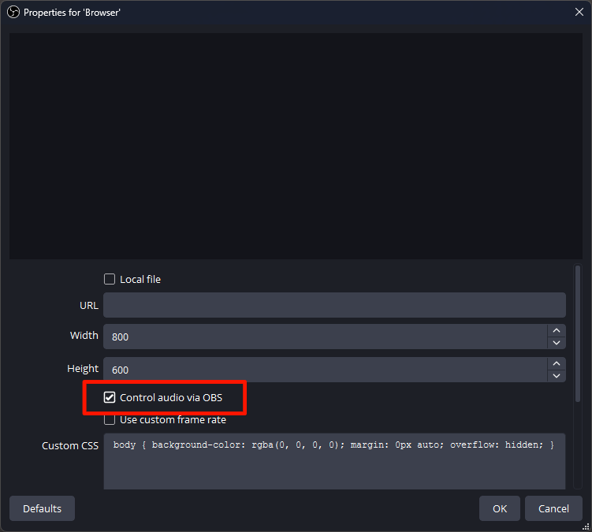
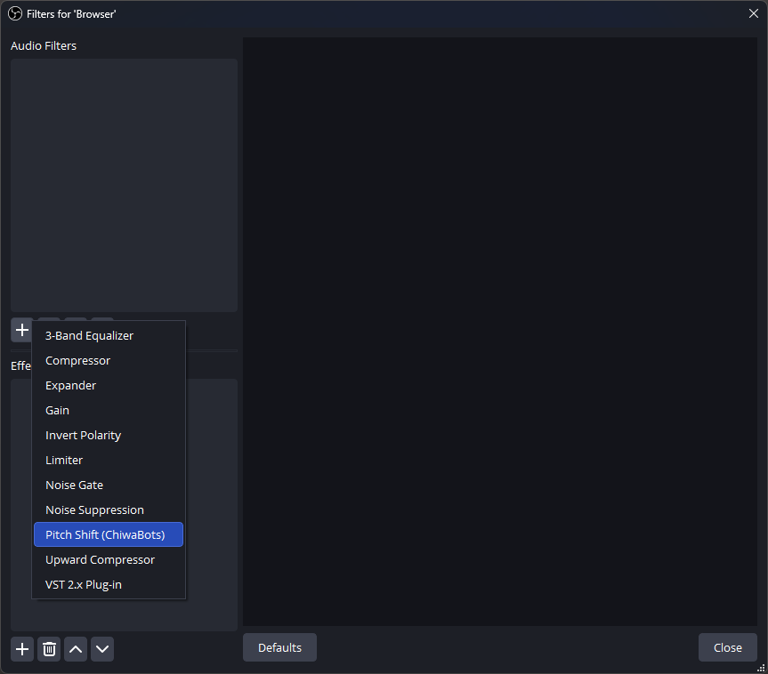
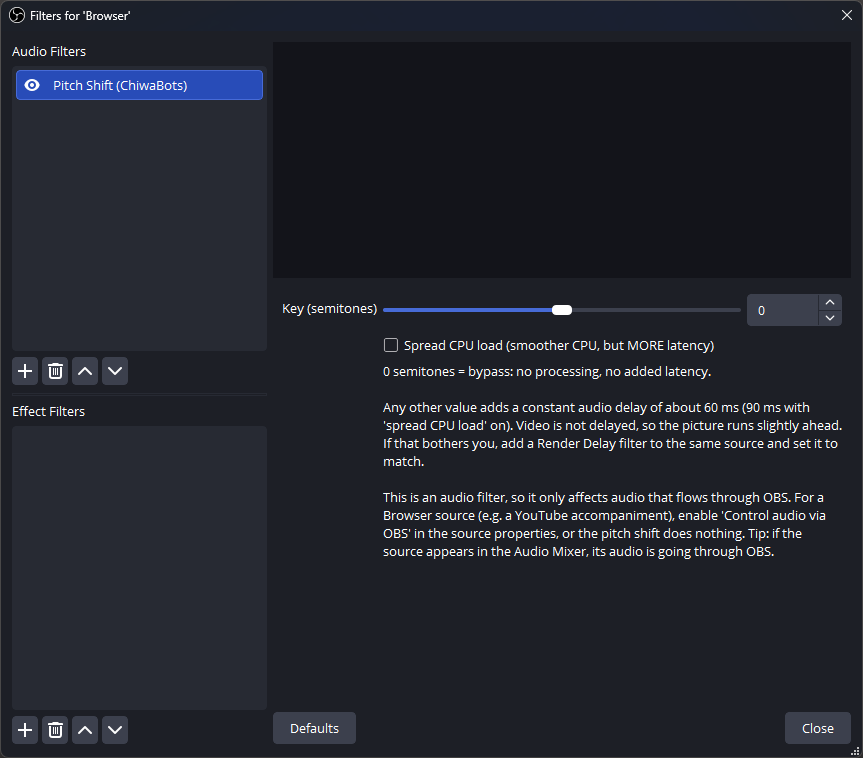
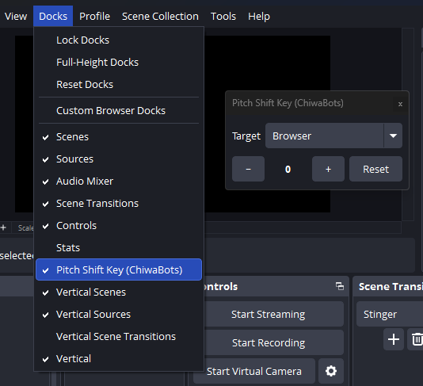

# cb-pitch-shift

**English** · [繁體中文](README.zh-TW.md) · [日本語](README.ja.md)

A pitch-shift audio filter for [OBS Studio](https://obsproject.com/). It moves a source's audio up or down by whole semitones without changing the tempo, and adds a dock so you can change the key with one click while streaming.

The main use case is karaoke and cover streams. Put the backing track on a Browser or Media source, add this filter to it, and raise or lower the key to suit the singer. The microphone sits on a different source, so the vocals are not affected.

This is a third-party plugin made by [ChiwaBots](https://chiwabots.com). It is not part of OBS Studio and is not affiliated with the OBS Project. See [Trademarks](#trademarks) and [AI disclosure](#ai-disclosure) below.

**Contents:** [Features](#features) · [Install](#install) · [Uninstall](#uninstall) · [Usage](#usage) · [Build from source](#build-from-source) · [AI disclosure](#ai-disclosure) · [License](#license)

## Features

- Transpose from -12 to +12 semitones. Tempo is preserved (phase-vocoder pitch shifting).
- 0 semitones is a bypass: no processing, no added latency.
- When active, the audio is delayed by a constant ~60 ms (see the note inside the filter). Video is not delayed, so add a Render Delay filter to the same source if you need exact sync.
- A dock ("Pitch Shift Key") that lets you pick the target source, move the key with `-` / `+`, reset to 0, and see the current value. If the target's audio is not routed through OBS, the dock shows a warning.
- Localized in English, 繁體中文, 简体中文, 日本語, 한국어 and Español.
- Windows, macOS and Linux. Requires OBS 31.1 or newer.

## Install

Download the file for your platform from the *Releases* page.

### Windows

Two options:

- **Installer** (`…-windows-x64.exe`): double-click it and follow the wizard. The installer is not code-signed, so Windows SmartScreen shows an "unknown publisher" prompt the first time. Click *More info*, then *Run anyway*. The wizard follows your Windows display language (English, 繁體中文, 简体中文, 日本語, 한국어, Español).
- **ZIP** (`…-windows-x64.zip`): copy the `cb-pitch-shift` folder into `%ProgramData%\obs-studio\plugins\`. There is no SmartScreen prompt, but you install and remove the files yourself.

Restart OBS afterwards.

Portable OBS looks for plugins relative to its own folder rather than `%ProgramData%`, so the installer does not work for it. Use the ZIP instead: copy `cb-pitch-shift\bin\64bit\cb-pitch-shift.dll` into `<your OBS>\obs-plugins\64bit\`, and the contents of `cb-pitch-shift\data\` into `<your OBS>\data\obs-plugins\cb-pitch-shift\`.

### macOS

Open the `.pkg`, follow the installer, then restart OBS.

The `.pkg` is not notarized, because that requires a paid Apple Developer account. Gatekeeper therefore blocks it the first time: double-clicking shows "Apple could not verify … it may contain malware" with only *Done* and *Move to Trash*, and no *Open* button. Click *Done*, then do one of the following once:

- In Terminal, remove the download quarantine flag and open the `.pkg` again:

  ```bash
  xattr -dr com.apple.quarantine ~/Downloads/cb-pitch-shift-*-macos-universal.pkg
  ```

- Or go to *System Settings → Privacy & Security*, scroll down, click *Open Anyway* next to the blocked `.pkg`, authenticate, and open the `.pkg` again.

The installer puts `cb-pitch-shift.plugin` in `~/Library/Application Support/obs-studio/plugins/`. Apple Silicon requires at least an ad-hoc signature for the bundle to load; the CI build already applies one, so the plugin loads normally once installed.

### Linux

Two options:

- **`.deb`**: `sudo apt install ./cb-pitch-shift-*.deb`. This installs into `/usr`, which is where OBS from the official PPA (`ppa:obsproject/obs-studio`) or your distribution's package lives. If OBS does not pick the plugin up, your OBS is probably installed under a different prefix (for example a downloaded build under `/usr/local`, or a Flatpak/Snap sandbox). See below.
- **Per-user install**: works with any non-sandboxed OBS, needs no `sudo`, and survives OBS updates. Extract the tarball (or copy the files out of the `.deb`) into `~/.config/obs-studio/plugins/cb-pitch-shift/` so that you end up with:

  ```
  ~/.config/obs-studio/plugins/cb-pitch-shift/bin/64bit/cb-pitch-shift.so
  ~/.config/obs-studio/plugins/cb-pitch-shift/data/locale/*.ini
  ```

Restart OBS afterwards.

If the plugin is installed but the filter does not show up in OBS, the paths probably do not match. OBS scans the plugin directory under its own install prefix. Run `dpkg -L obs-studio | grep obs-plugins` to see where OBS keeps its bundled plugins; the `.so` has to go in that same tree. Flatpak and Snap builds of OBS are sandboxed and cannot see system-installed plugins at all. For those, use the per-user install, or install OBS from the official PPA.

## Uninstall

- **Windows (installer):** *Settings → Apps* (or *Control Panel → Programs and Features*), find **Pitch Shift (ChiwaBots)** and uninstall it.
- **Windows (ZIP):** delete the `cb-pitch-shift` folder from `%ProgramData%\obs-studio\plugins\`.
- **macOS:** delete `~/Library/Application Support/obs-studio/plugins/cb-pitch-shift.plugin`. A `.pkg` has no uninstaller, so this is a manual step.
- **Linux (.deb):** `sudo apt remove cb-pitch-shift` (or `sudo dpkg -r cb-pitch-shift`).
- **Linux (per-user):** delete `~/.config/obs-studio/plugins/cb-pitch-shift/`.

Restart OBS afterwards.

## Usage

### 1. Put the backing track on its own source

Add the accompaniment as a Browser source (for a YouTube or karaoke link) or a Media source (for a local file). Keep the singer's microphone on a separate source. The filter only affects the source it is attached to, so the vocals stay as they are.

### 2. Route the backing track's audio through OBS

This is an audio filter, so it can only process audio that passes through OBS. By default a Browser source plays its audio straight to your speakers, and the filter receives nothing. Open the source's **Properties** and enable **Control audio via OBS**. The source then appears in the Audio Mixer, which is how you can tell that its audio is going through OBS.



### 3. Add the filter

Right-click the backing-track source and choose **Filters**. Under *Audio Filters*, click **+** and pick **Pitch Shift (ChiwaBots)**.



### 4. Set the key

Drag **Key (semitones)** between -12 and +12. 0 is a bypass (no processing, no added latency). Higher values raise the key.



### 5. Change the key from the dock

Open **Docks → Pitch Shift Key (ChiwaBots)** from the OBS menu bar. Pick the target source in the dropdown, then use **-** / **+** to change the key or **Reset** to go back to 0. The current value is shown between the buttons, and the filter's slider follows it.



If the target's audio is not routed through OBS (step 2), the dock shows a **⚠** and a hint. The pitch shift does nothing until *Control audio via OBS* is turned on.

### Notes and troubleshooting

- The filter adds about 60 ms of audio latency when active. The video is not delayed, so the picture runs slightly ahead. To realign, add a *Render Delay* filter to the same source and set it to about 60 ms.
- No change in the sound: the source's audio is not going through OBS. Go back to step 2. The **⚠** in the dock points to the same problem.
- Filter or dock missing after installing: restart OBS, and check that the plugin went into the right directory for your OBS install (see [Install](#install)).

## Build from source

The build uses the standard [obs-plugintemplate](https://github.com/obsproject/obs-plugintemplate) tooling. The CMake presets download the pinned OBS, obs-deps and Qt6 (see `buildspec.json`) and the DSP headers, so you do not need a local OBS build.

Requirements: CMake 3.28 or newer, Git, and a platform toolchain: Visual Studio 2022 with the C++ desktop workload on Windows, Xcode on macOS, or GCC/Clang plus Ninja on Linux.

```bash
# Windows
cmake --preset windows-x64
cmake --build --preset windows-x64

# macOS
cmake --preset macos
cmake --build --preset macos

# Linux
cmake --preset ubuntu-x86_64
cmake --build --preset ubuntu-x86_64
```

Release artifacts for all three platforms are built by GitHub Actions (see `.github/workflows/`) on every push.

## Third-party components

- [Signalsmith Stretch](https://github.com/Signalsmith-Audio/signalsmith-stretch) and [signalsmith-linear](https://github.com/Signalsmith-Audio/linear): MIT, header-only. This is the pitch-shift DSP. Fetched at configure time.
- Qt 6: used for the dock, linked against the Qt that OBS ships (LGPL/GPL).
- libobs / obs-frontend-api (OBS Studio): GPL-2.0-or-later.

## Bugs and feedback

Please open an issue on this repository's *Issues* tab. Bug reports, setup questions and feature requests are all welcome.

## Trademarks

"OBS", "OBS Studio" and the OBS logo are trademarks of the OBS Project. This plugin is an independent third-party tool. It is not produced, endorsed or supported by the OBS Project, and ChiwaBots has no partnership with them. The OBS Studio screenshots in this README are there only to show how to use the filter.

## AI disclosure

Parts of this plugin were written with an AI coding assistant (Anthropic's Claude, used through Claude Code). It helped draft and revise the C++ filter and the Qt dock, the CMake and CI configuration, the six locale files, and this README. It was not used for the pitch-shift DSP, which is the third-party [Signalsmith Stretch](https://github.com/Signalsmith-Audio/signalsmith-stretch) library.

The design, code review and testing were done by a person. Every change was read before it was merged. Each release is installed into OBS Studio on Windows, macOS and Linux to confirm that the filter and the dock load, and the audio result is checked by ear on Windows.

## License

GPL-2.0-or-later. See [LICENSE](LICENSE). The plugin links against libobs, which is distributed under the GNU GPL, so it is released under a compatible license.
