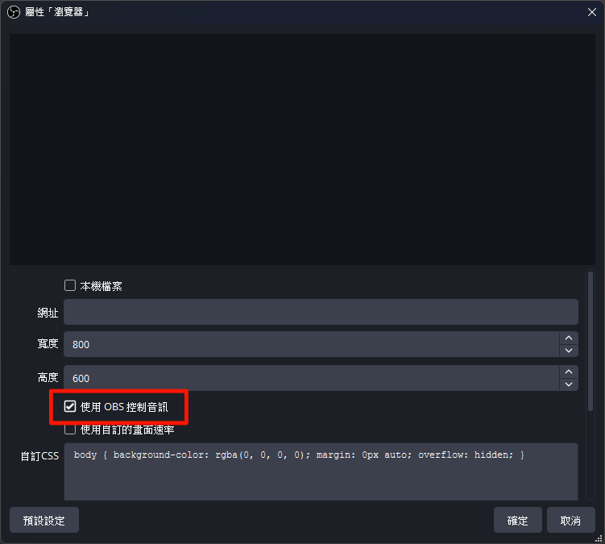
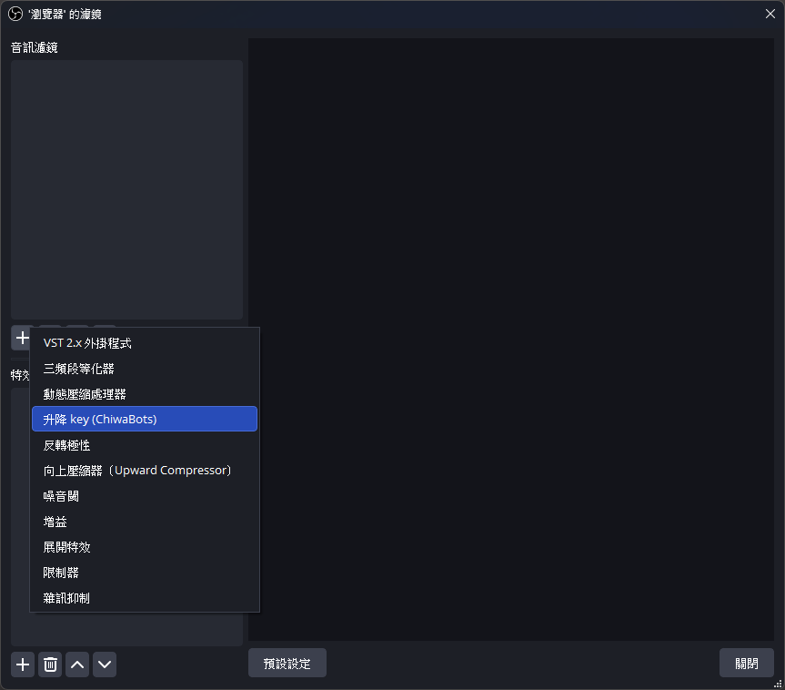
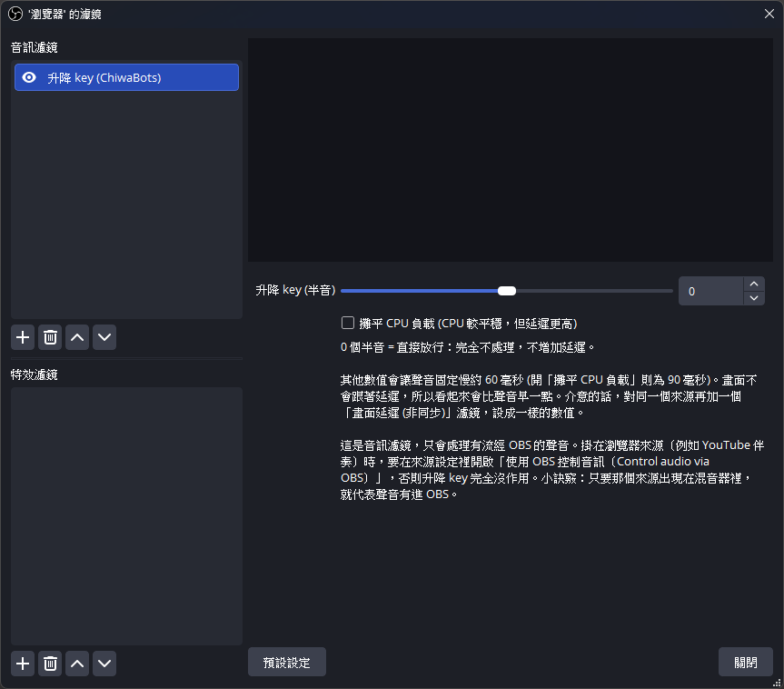
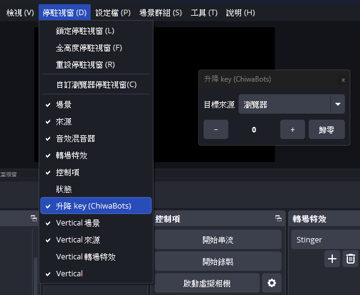

# cb-pitch-shift

[English](README.md) · **繁體中文** · [日本語](README.ja.md)

給 [OBS Studio](https://obsproject.com/) 用的變調（升降 key）音訊濾鏡。它會把來源的聲音以半音為單位上下移調，速度不變；另外附一個停駐視窗（dock），直播中點一下就能換 key。

主要用途是翻唱和卡拉OK 直播。把伴奏放在瀏覽器來源或媒體來源上，加上這個濾鏡，再依歌手的音域升降 key。麥克風放在另一個來源，所以人聲不會被動到。

這是 [ChiwaBots](https://chiwabots.com) 製作的第三方插件，不是 OBS Studio 的一部分，與 OBS Project 也沒有隸屬關係。詳見下方的[商標](#商標)與 [AI 使用聲明](#ai-使用聲明)。

**目錄：** [功能](#功能) · [安裝](#安裝) · [解除安裝](#解除安裝) · [使用教學](#使用教學) · [從原始碼建置](#從原始碼建置) · [AI 使用聲明](#ai-使用聲明) · [授權](#授權)

## 功能

- 移調範圍 -12 到 +12 半音，速度不變（相位聲碼器式變調）。
- 0 半音就是直接放行：不處理、不增加延遲。
- 啟用時音訊固定延遲約 60 ms（濾鏡裡有說明）。畫面不會延遲，需要精確對齊的話，在同一個來源再加一個「畫面延遲（非同步）」濾鏡。
- 停駐視窗（OBS 裡叫「升降 key (ChiwaBots)」）：選目標來源、用 `-` / `+` 調 key、歸零，並顯示目前的值。目標來源的音訊沒走 OBS 時，停駐視窗會顯示警告。
- 六種語言：English、繁體中文、简体中文、日本語、한국어、Español。
- 支援 Windows、macOS、Linux，需要 OBS 31.1 以上。

## 安裝

到 *Releases* 頁下載你平台對應的檔案。

### Windows

兩種方式：

- **安裝程式**（`…-windows-x64.exe`）：雙擊後照精靈走。安裝程式沒有程式碼簽章，所以 Windows SmartScreen 第一次會跳「不明發行者」提示，點*更多資訊*、再點*仍要執行*。安裝精靈會跟隨你的 Windows 顯示語言（英、繁中、简中、日、韓、西）。
- **ZIP**（`…-windows-x64.zip`）：把 `cb-pitch-shift` 資料夾複製到 `%ProgramData%\obs-studio\plugins\`。不會有 SmartScreen 提示，但安裝和移除都要自己動手。

裝完重開 OBS。

綠色版（可攜式）OBS 找插件的位置是相對於它自己的資料夾，不是 `%ProgramData%`，所以安裝程式對它無效。請用 ZIP：把 `cb-pitch-shift\bin\64bit\cb-pitch-shift.dll` 複製到 `<你的OBS>\obs-plugins\64bit\`，把 `cb-pitch-shift\data\` 裡的東西複製到 `<你的OBS>\data\obs-plugins\cb-pitch-shift\`。

### macOS

打開 `.pkg`，照安裝程式走，然後重開 OBS。

這個 `.pkg` 沒有公證，因為公證需要付費的 Apple 開發者帳號。所以 Gatekeeper 第一次會擋：雙擊時會出現「Apple 無法驗證……是否為惡意軟體」，只有「完成」和「丟到垃圾桶」兩個按鈕，沒有「打開」。按「完成」，然後從下面擇一做一次：

- 在終端機清掉下載隔離標記，再重新打開 `.pkg`：

  ```bash
  xattr -dr com.apple.quarantine ~/Downloads/cb-pitch-shift-*-macos-universal.pkg
  ```

- 或到*系統設定 → 隱私權與安全性*，往下捲，在被封鎖的 `.pkg` 旁點「仍要打開」，輸入密碼後再開一次 `.pkg`。

安裝程式會把 `cb-pitch-shift.plugin` 放到 `~/Library/Application Support/obs-studio/plugins/`。Apple Silicon 至少要有 ad-hoc 簽章才載得起來，CI build 已經簽好，裝好後插件就能正常載入。

### Linux

兩種方式：

- **`.deb`**：`sudo apt install ./cb-pitch-shift-*.deb`。會裝到 `/usr`，也就是官方 OBS PPA（`ppa:obsproject/obs-studio`）或你發行版套件的 OBS 所在的位置。如果 OBS 沒抓到插件，多半是你的 OBS 裝在別的前綴（例如下載的 build 裝在 `/usr/local`，或是 Flatpak/Snap 沙盒），見下方說明。
- **使用者目錄安裝**：適用任何非沙盒的 OBS，不需要 `sudo`，OBS 升級也不會被清掉。把 tarball 解壓（或把 `.deb` 裡的檔案複製出來）到 `~/.config/obs-studio/plugins/cb-pitch-shift/`，結構如下：

  ```
  ~/.config/obs-studio/plugins/cb-pitch-shift/bin/64bit/cb-pitch-shift.so
  ~/.config/obs-studio/plugins/cb-pitch-shift/data/locale/*.ini
  ```

裝完重開 OBS。

裝了但 OBS 裡看不到濾鏡，多半是路徑對不上。OBS 掃的是它自己安裝前綴底下的插件目錄。用 `dpkg -L obs-studio | grep obs-plugins` 看 OBS 自帶的插件放在哪，`.so` 就要放到同一棵目錄樹底下。Flatpak 和 Snap 版的 OBS 是沙盒，完全看不到系統安裝的插件；這種情況請改用使用者目錄安裝，或改裝官方 PPA 的 OBS。

## 解除安裝

- **Windows（安裝程式）：** *設定 → 應用程式*（或*控制台 → 程式和功能*），找到 **升降 key (ChiwaBots)** 並解除安裝。
- **Windows（ZIP）：** 刪掉 `%ProgramData%\obs-studio\plugins\` 底下的 `cb-pitch-shift` 資料夾。
- **macOS：** 刪掉 `~/Library/Application Support/obs-studio/plugins/cb-pitch-shift.plugin`。`.pkg` 沒有反安裝器，所以要手動刪。
- **Linux（.deb）：** `sudo apt remove cb-pitch-shift`（或 `sudo dpkg -r cb-pitch-shift`）。
- **Linux（使用者目錄）：** 刪掉 `~/.config/obs-studio/plugins/cb-pitch-shift/`。

之後重開 OBS。

## 使用教學

### 1. 把伴奏放在自己的來源上

把伴奏加成瀏覽器來源（YouTube 或卡拉OK 連結）或媒體來源（本機檔案）。歌手的麥克風放在另一個來源。濾鏡只影響它掛上去的那個來源，所以人聲不會變。

### 2. 讓伴奏的音訊走 OBS

這是音訊濾鏡，只能處理走 OBS 的聲音。瀏覽器來源預設把聲音直接送到喇叭，濾鏡什麼都收不到。打開來源的**屬性**，勾選**使用 OBS 控制音訊**。之後來源會出現在音效混音器裡，那就代表它的音訊有走 OBS。



### 3. 加上濾鏡

在伴奏來源上按右鍵，選**濾鏡**。在*音訊濾鏡*底下點 **+**，選 **升降 key (ChiwaBots)**。



### 4. 設定 key

拖動 **升降 key (半音)**，範圍 -12 到 +12。0 是直接放行（不處理、不增加延遲），數值越高 key 越高。



### 5. 從停駐視窗換 key

從 OBS 選單列打開 **停駐視窗 → 升降 key (ChiwaBots)**。在下拉選單選目標來源，再用 **-** / **+** 調 key，或按 **歸零** 回到 0。目前的值顯示在兩顆按鈕中間，濾鏡的滑桿也會跟著動。



如果目標來源的音訊沒走 OBS（第 2 步），停駐視窗會顯示 **⚠** 和提示。在打開*使用 OBS 控制音訊*之前，變調不會有作用。

### 小提醒與疑難排解

- 啟用時音訊延遲約 60 ms。畫面不會延遲，所以畫面會略早一點。要對齊的話，在同一個來源加一個「畫面延遲（非同步）」濾鏡，設成約 60 ms。
- 聲音沒變化：來源的音訊沒走 OBS，回到第 2 步。停駐視窗上的 **⚠** 指的就是這個問題。
- 裝完看不到濾鏡或停駐視窗：重開 OBS，並確認插件有裝到你這套 OBS 對應的目錄（見[安裝](#安裝)）。

## 從原始碼建置

建置用的是標準的 [obs-plugintemplate](https://github.com/obsproject/obs-plugintemplate) 工具鏈。CMake preset 會自動下載 pin 好的 OBS、obs-deps、Qt6（見 `buildspec.json`）和 DSP 標頭，所以不需要本機先建好 OBS。

需求：CMake 3.28 以上、Git，以及各平台的工具鏈：Windows 用 Visual Studio 2022（C++ 桌面工作負載），macOS 用 Xcode，Linux 用 GCC/Clang 加 Ninja。

```bash
# Windows
cmake --preset windows-x64
cmake --build --preset windows-x64

# macOS
cmake --preset macos
cmake --build --preset macos

# Linux
cmake --preset ubuntu-x86_64
cmake --build --preset ubuntu-x86_64
```

三個平台的 Release 產物由 GitHub Actions（見 `.github/workflows/`）在每次 push 時建置。

## 第三方元件

- [Signalsmith Stretch](https://github.com/Signalsmith-Audio/signalsmith-stretch) 與 [signalsmith-linear](https://github.com/Signalsmith-Audio/linear)：MIT、header-only，就是變調的 DSP，在 configure 時抓取。
- Qt 6：停駐視窗用，連結 OBS 自帶的那份 Qt（LGPL/GPL）。
- libobs / obs-frontend-api（OBS Studio）：GPL-2.0-or-later。

## 回報問題

請到本 repo 的 *Issues* 開一則 issue。bug 回報、安裝上的疑問、功能建議都歡迎。

## 商標

「OBS」「OBS Studio」與 OBS 標誌是 OBS Project 的商標。本插件是獨立的第三方工具，不是由 OBS Project 製作、背書或支援，ChiwaBots 與 OBS Project 也沒有合作關係。本說明裡的 OBS Studio 截圖只用來示範濾鏡的操作方式。

## AI 使用聲明

本插件有一部分是在 AI 程式輔助工具（Anthropic 的 Claude，透過 Claude Code）協助下寫成的。它協助起草和修改了 C++ 濾鏡與 Qt 停駐視窗、CMake 與 CI 設定、六個語系檔，還有這份 README。變調 DSP 沒有用到它，那是第三方的 [Signalsmith Stretch](https://github.com/Signalsmith-Audio/signalsmith-stretch) 函式庫。

設計、程式碼審閱和測試都是人做的。每一次變更都有人讀過才合併。每個版本都會實際裝進 Windows、macOS、Linux 三個平台的 OBS Studio，確認濾鏡和停駐視窗載入得起來；聲音的結果則在 Windows 上用耳朵驗過。

## 授權

GPL-2.0-or-later，見 [LICENSE](LICENSE)。本插件連結 libobs，而 libobs 以 GNU GPL 散布，所以本插件也以相容的授權釋出。
